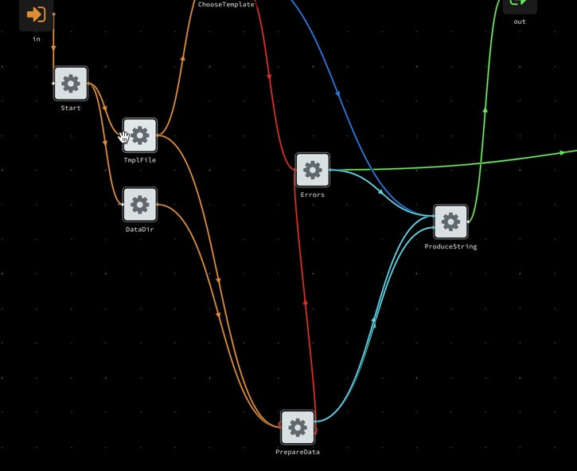

## Flow based programming

TODO

Angular library to define flows + demo 

### Create project specific component

    $>  ng g c foo --project=flow-based
    

## Resources

   * https://www.youtube.com/watch?v=WjJdaDXN5Vs&index=4&list=LLRfaN_LmYUHepKKDWAjV9nw
   * https://app.flowhub.io/#project/138d806e-2b18-4cb5-961b-d7148258deeb/d13c397f-02e0-4d96-859c-abfe268d8bad
   * Nice article: https://colab.coop/blog/how-to-start-flowing-with-flow-based-programming/
   * Bezier demo: https://stackblitz.com/edit/angular-bezier-curves
