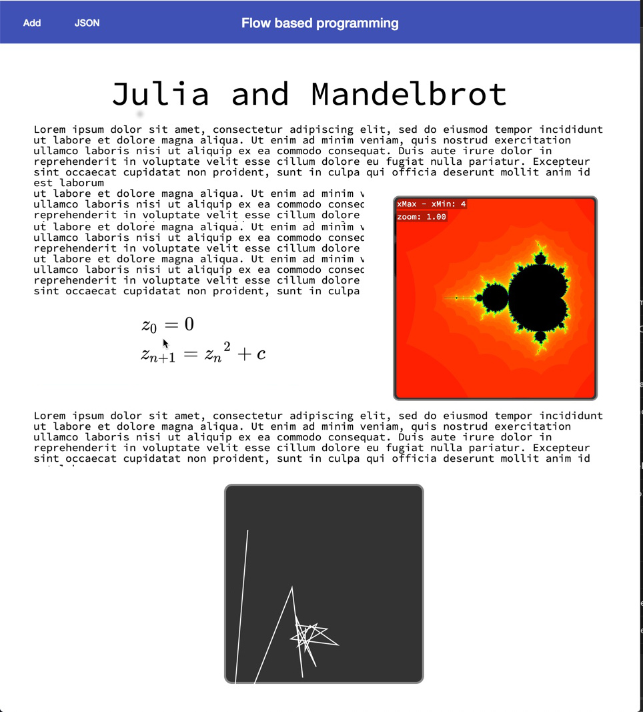
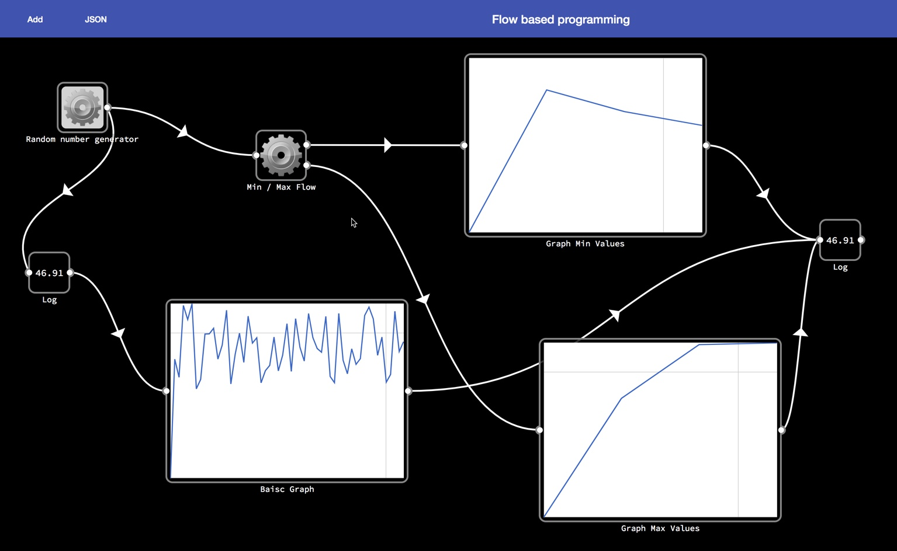
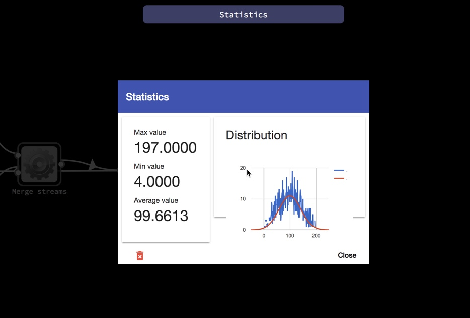

## Flow based programming

Although a lot is still changing and very buggy, the current state can be seen [here](https://scaljeri.github.io/flow-based/) 

Angular library for building workflows + demo 

Library to create Data flow diagrams with leveling. Depending on the visualisation, it can be just a DFD or documentation. 
The whole flow is also represented as JSON, which can be exported

### TODO

  * Support multiple visualisation
  * Rewrite library in web-components (lit-element or StencilJS)
  * Build demo app in Angular, React and Vue
  * Make nodes external components, which can be npm dependencies

### Create project specific component

    $>  ng g c foo --project=flow-based
    
### Deploy to gh-pages

  $>  ng build --prod --base-href "https://scaljeri.github.io/flow-based/" --output-path="dist/"
  $>  ngh
  
# Publish to npm

   $> yarn build
   $> cd dist/flow-based && npm publish --access=public

## Resources

   * https://www.youtube.com/watch?v=WjJdaDXN5Vs&index=4&list=LLRfaN_LmYUHepKKDWAjV9nw
   * https://app.flowhub.io/#project/138d806e-2b18-4cb5-961b-d7148258deeb/d13c397f-02e0-4d96-859c-abfe268d8bad
   * Nice article: https://colab.coop/blog/how-to-start-flowing-with-flow-based-programming/
   * Bezier demo: https://stackblitz.com/edit/angular-bezier-curves
   * Audio: http://webaudiodemos.appspot.com/
   * Gauss/charts: https://stackblitz.com/edit/google-charts?file=app%2Fgraph%2Fgraph.component.ts
   * Node red: https://flows.nodered.org/node/node-red-dashboard
   * Setup webworker: https://stackoverflow.com/questions/43276044/angular-cli-generated-app-with-web-workers/43276045#43276045
   * Julia Set demo: http://bl.ocks.org/syntagmatic/3736720, http://jsfiddle.net/b6Wb5/
   * Approximage Pi with mandelbrot: https://www.youtube.com/watch?v=d0vY0CKYhPY
   * Some similar: https://www.luna-lang.org/#Overview
   * Mandelbrot computation comparissons: https://github.com/ColinEberhardt/wasm-mandelbrot
   * Cardioide: https://nl.wikipedia.org/wiki/Cardio%C3%AFde

### Notes: 
  * Mandelbrot: cusp, Seahorse tail
## POCs

  * https://stackblitz.com/edit/flow-based-programming
  * https://stackblitz.com/edit/angular-bezier-curves

### TODO
  * Refactor sockets setup
  * Put all z-indices in a $variable
