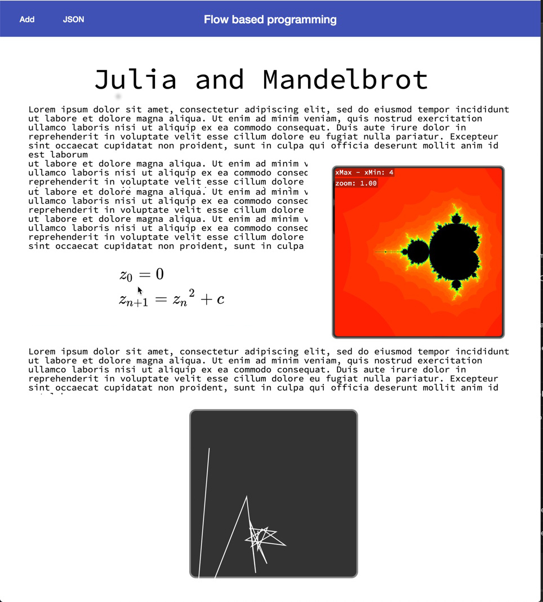
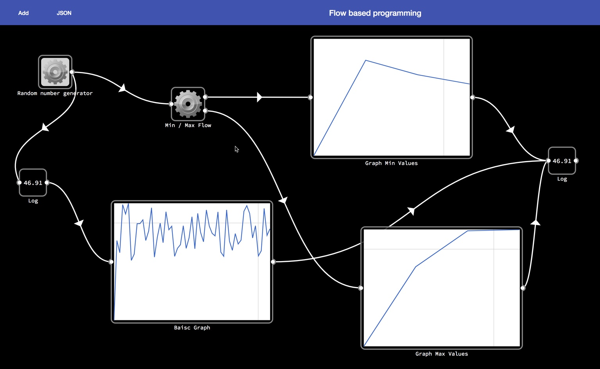
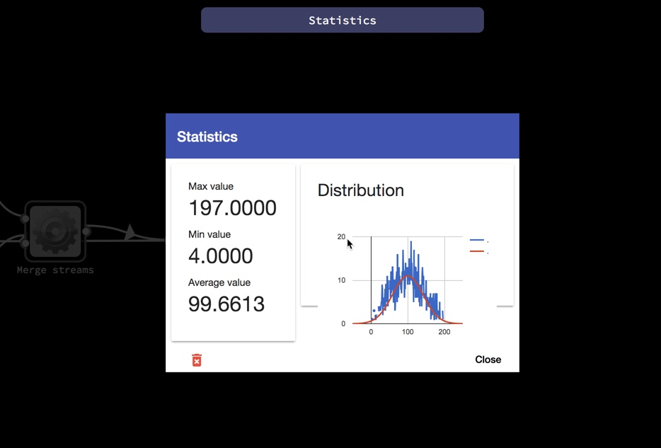

## Flow based programming

Angular library for building flow-based programs / data flow diagrams, plus a demo app.
The current state can be seen [here](https://scaljeri.github.io/flow-based/).

Library to create Data flow diagrams with leveling. Depending on the visualisation, it can be just a DFD or documentation.
The whole flow is also represented as JSON, which can be exported.

## Requirements

  * Node 22.22.3+, 24.15.0+ or 26+ (Angular 22's supported range)
  * npm (the workspace is npm-locked; there is no yarn.lock any more)

## Getting started

    $> npm install
    $> npm start          # builds the library, then serves the demo on :4200

The demo consumes the library through its published entry point
(`@scaljeri/flow-based`, mapped by `tsconfig.json` to `dist/flow-based`) rather
than by reaching into its source. That means the demo only compiles if the
package's public API is actually complete — which is the point.

## Commands

| Command | What it does |
|---|---|
| `npm start` | Build the library, then serve the demo |
| `npm run build:core` | Build `@scaljeri/flow-based-core` into `dist/flow-based-core` |
| `npm run build:lib` | Build the core, then the Angular library into `dist/flow-based` |
| `npm run build:demo` | Build the library, then the demo into `dist/demo` |
| `npm run watch:lib` | Rebuild the library on change |
| `npm test` | Unit tests (vitest, via `ng test`) for library and demo |
| `npm run test:lib` | Unit tests for the library only |
| `npm run lint` | ESLint over TypeScript and templates |
| `npm run e2e` | Playwright smoke tests (starts the dev server itself) |
| `npm run ngh` | Build and deploy the demo to gh-pages |

### Create a project specific component

    $>  ng g c foo --project=@scaljeri/flow-based

### Publish to npm

    $>  npm run build:lib
    $>  cd dist/flow-based && npm publish --access=public

## Architecture

Three published packages in one repo:

  * **`@scaljeri/flow-based-core`** (`projects/flow-based-core`) — the
    framework-agnostic half: the node/connection model, the graph engine
    (`flow.ts`), socket-format propagation, serialisation, undo/redo, viewport
    maths and the worker contract. No Angular; an ESLint rule enforces that, so a
    Lit, React or Vue shell can sit on the same engine and the same JSON.
  * **`@scaljeri/flow-based-lit`** (`projects/flow-based-lit`) — a web-component
    shell: `<fb-flow-canvas>`, `<fb-node-box>`, `<fb-connections>` and
    `<fb-flow-document>`. No Angular; `npm run build:lit-demo && npm run
    serve:lit-demo` runs it standalone, and its e2e tests assert that no Angular
    is loaded on the page.
  * **`@scaljeri/flow-based`** (`projects/flow-based`) — the Angular shell:
    components, directives, injection tokens, and thin signal wrappers over the
    core's plain classes. Re-exports the core, so Angular consumers still have a
    single import.
  * `src` — the demo. Node types are registered in `src/app/fb-settings.ts` as
    `{component, settings, worker}`: the component draws the node, the
    `FbNodeWorker` computes it, and they are wired together by RxJS streams per
    socket.
  * Composite ("flow") nodes nest a whole flow inside a node, bridged by
    `FlowWorker` — this is the "leveling" the diagrams above show.

## Extending it

  * **[docs/NODE-AUTHORING.md](docs/NODE-AUTHORING.md)** — writing one node type.
  * **[docs/MODULES.md](docs/MODULES.md)** — writing a module: a bundle of node
    types that joins a running editor. One exported object; the rest of the page
    is what goes inside it.
  * **[docs/MODULES-FROM-A-URL.md](docs/MODULES-FROM-A-URL.md)** — design note for
    loading modules from a URL and what a community server would need.

[docs/README.md](docs/README.md) indexes all of it, including
[docs/AUDIT.md](docs/AUDIT.md) for the architecture assessment and staged roadmap
and [docs/MIGRATION-CHECKLIST.md](docs/MIGRATION-CHECKLIST.md) for the Angular
7 → 22 migration record.

## Editing

  * **Zoom / pan** — wheel zooms at the cursor, dragging empty canvas pans, and the
    on-canvas controls zoom in/out or reset. Node positions are percentages of a
    fixed graph plane, so resizing the window translates the graph rather than
    distorting it.
  * **Undo / redo** — `Ctrl`/`Cmd`+`Z` and `Ctrl`/`Cmd`+`Shift`+`Z`, or the toolbar.
  * **Save / load** — downloads a versioned JSON envelope (`{version, flow}`) and
    reads both that and older bare-flow files.
  * **Validation** — the toolbar reports sockets whose format could not be
    negotiated, and any cycles in the graph.
  * **Searchable palette** — filter flow units by name; `Enter` adds a sole match.
  * **Document view** (web-component shell) — the same JSON read as a document:
    prose with the node visuals embedded as figures. The figures are the live node
    components, not screenshots, so a fractal in the document is still computing.
    Authored via `flow.document`, and derived from the graph when absent.

### TODO

  * Derive socket positions from graph coordinates instead of measuring the DOM
  * Make the Angular package a thin wrapper over the web components (the shells
    are currently two implementations; the core and the mount contract are shared)
  * Rich text and formulas in the document view (currently plain paragraphs)
  * Build demo app in Angular, React and Vue
  * Make nodes external components, which can be npm dependencies
  * Real web-worker modules (the fractal worker still stringifies a class)
  * Orthogonal connection routing, multi-select, copy/paste

## Resources

   * https://www.youtube.com/watch?v=WjJdaDXN5Vs&index=4&list=LLRfaN_LmYUHepKKDWAjV9nw
   * https://app.flowhub.io/#project/138d806e-2b18-4cb5-961b-d7148258deeb/d13c397f-02e0-4d96-859c-abfe268d8bad
   * Nice article: https://colab.coop/blog/how-to-start-flowing-with-flow-based-programming/
   * Bezier demo: https://stackblitz.com/edit/angular-bezier-curves
   * Audio: http://webaudiodemos.appspot.com/
   * Gauss/charts: https://stackblitz.com/edit/google-charts?file=app%2Fgraph%2Fgraph.component.ts
   * Node red: https://flows.nodered.org/node/node-red-dashboard
   * Setup webworker: https://stackoverflow.com/questions/43276044/angular-cli-generated-app-with-web-workers/43276045#43276045
   * Julia Set demo: http://bl.ocks.org/syntagmatic/3736720, http://jsfiddle.net/b6Wb5/
   * Approximage Pi with mandelbrot: https://www.youtube.com/watch?v=d0vY0CKYhPY
   * Some similar: https://www.luna-lang.org/#Overview
   * Mandelbrot computation comparissons: https://github.com/ColinEberhardt/wasm-mandelbrot
   * Cardioide: https://nl.wikipedia.org/wiki/Cardio%C3%AFde

### Notes:
  * Mandelbrot: cusp, Seahorse tail

## POCs

  * https://stackblitz.com/edit/flow-based-programming
  * https://stackblitz.com/edit/angular-bezier-curves
